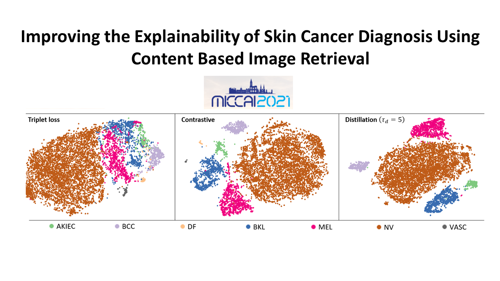

# CBIR_Explainability_Skin_Cancer
A **Tensorflow** implementation of a **CBIR Explainable Model** for the diagnosis of skin lesions.
**PyTorch** implementation coming soon....



## Requirements
Tensorflow version >= 2.3

Python >= 3.6

Scikit-learn

Tf_slim

## Usage
1) Download the dataset tf recorders from **https://tinyurl.com/yd65v34z** and add to the **data** folder or create your own tf records and add them to the **same** folder

2) Train a model using a specific fold, network, batch_size, and number of epochs: python  model_train.py 

## Reference

```
@inproceedings{barata2021,
  title={Improving the Explainability of Skin Cancer Diagnosis Using CBIR},
  author={Barata, Catarina and Santiago, Carlos},
  booktitle={Accepted for Publication in },
  year={2021}
}


```
